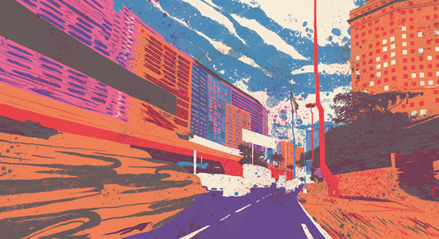

## 基于Jquery的无缝轮播图的实现
### 继上次整理慕课网视频的tabs切换实现之后，今天整理一下极客学院的基于Jquery的轮播图的实现。
主要功能展示：

 - 左右按钮点击实现左右移动
 - 轮播图自动左右切换
 - 无缝轮播
 - 去除快速点击切换导致的卡顿

### 一、基本页面结构和样式的设计
```
<div class="banner">
    <ul class="img">
        <li><a href="#"></a></li>
        <li><a href="#"></a></li>
        <li><a href="#"></a></li>
        <li><a href="#"></a></li>
    </ul>

    <ul class="num">

    </ul>

    <div class="btn btn_l">&lt;</div>
    <div class="btn btn_r">&gt;</div>
</div>
```

```
*{padding:0;margin: 0;list-style: none;}
.banner{ position: relative;overflow:hidden;margin: 100px auto;border: 5px solid #000;width: 550px;height: 300px;}
.banner .img{position:absolute;width: 5000px;left: 0;top:0;}
.banner .img li{float: left;}

.banner .num{position: absolute;width:100%;bottom: 10px;text-align: center;font-size: 0px;
    left:0;}
.banner .num li{width: 10px;height: 10px;background: #888;border-radius: 50%;display: inline-block;margin: 0 3px;cursor: pointer;}
.banner .num li.onPoint{background: #F60;}

.banner .btn{position:absolute;display:none;width: 30px;height: 50px;line-height:50px;background:rgba(0,0,0,0.5);color:#fff;font-size:30px;top: 50%;margin-top: -25px;text-align: center;font-family: "宋体";}
.banner .btn_l{left:0;}
.banner:hover .btn{display: block;}
.banner .btn_r{right: 0;}
```

### 二、js部分的实现
```
$(document).ready(function () {
    var i = 0;
    var clone = $(".banner .img li").first().clone();
    $(".banner .img").append(clone);
    var liLength = $(".banner .img li").length;
    for(var j = 0;j<liLength - 1;j++){
        $(".banner .num").append("<li></li>")
    }
    $(".banner .num li").first().addClass("onPoint");

    /* 鼠标划入圆点 */
    $(".banner .num li").hover(function () {
       var index = $(this).index();
       i = index;
       $(".banner .img").animate({left:-index * 550},550);
       $(".banner .num li").eq(index).addClass("onPoint").siblings().removeClass("onPoint");
    });

    /* 自动轮播 */
    var t = setInterval(moveL,3000);

    /* 对banner定时器的操作 */
    $(".banner").hover(function () {
        clearInterval(t);
    },function () {
        t = setInterval(moveL,3000);
    });

    var timer = null;
    /* 向左的按钮 */
    $(".banner .btn_l").click(moveL);
    // $(".banner .btn_l").click(function () {
    //     clearTimeout(timer);
    //     timer = setTimeout(function () {
    //         moveL();
    //     },300);
    // });
    // $(".banner .btn_l").dblclick(function () {
    //     clearTimeout(timer);
    // });

    function moveL() {
        i++;
        if(i == liLength){
            $(".banner .img").css({left:0});
            i = 1;
        }
        // $(".banner .img").animate({left:-550*i},550);
        $(".banner .img").stop().animate({left:-550*i},550);
        if(i == liLength - 1){
            $(".banner .num li").eq(0).addClass("onPoint").siblings().removeClass("onPoint");
        }else {
            $(".banner .num li").eq(i).addClass("onPoint").siblings().removeClass("onPoint");
        }
    }

    /* 向右的按钮 */
    $(".banner .btn_r").click(moveR);
    // $(".banner .btn_r").click(function () {
    //     clearTimeout(timer);
    //     timer = setTimeout(function () {
    //         moveR();
    //     },300);
    // });
    // $(".banner .btn_r").dblclick(function () {
    //     clearTimeout(timer);
    // });

    function moveR() {
        i--;
        if(i == -1){
            $(".banner .img").css({left:-(liLength - 1)*550});
            i = liLength - 2;
        }
        // $(".banner .img").animate({left:-i*550},550);
        $(".banner .img").stop().animate({left:-i*550},550);
        $(".banner .num li").eq(i).addClass("onPoint").siblings().removeClass("onPoint");
    }
});
```
### 注意点

1.我们点击按钮实现左右移动的动画的时候，需要在animate()之前加上stop()方法；因为在快速点击的时候，
如果没有加上stop()方法，轮播图就会容易出现卡顿的时候或者一些意向不到的情况。除了stop()方法，
我们也可以在点击事件的方法中加上一个延时器并且禁止连续双击事件也可以实现，不过，稍微麻烦一点。
个人建议stop()。
 
 2.
```
<ul>
    <li></li>
    <li></li>
    <li></li>
</ul>
```

如上，这样的排列，```<li>```之间的换行或者空格符也属于字符，在页面显示的时候就会出现空格。```<ul>```样式设置``` font-size = 0 ```；就会清除空格样式。因为行框的排列会收到中间的影响，这些空白也会被应用样式占据空间，所以会有间隔。


